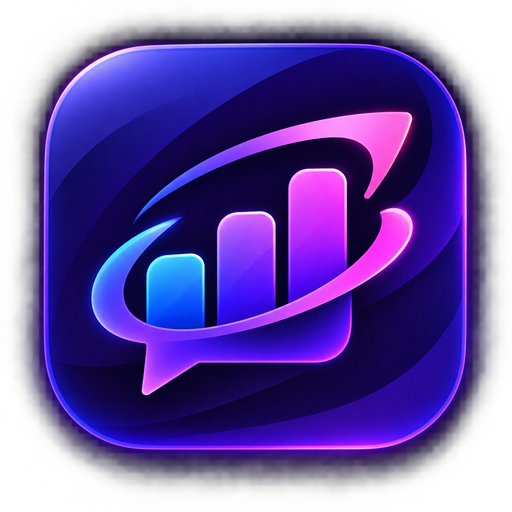
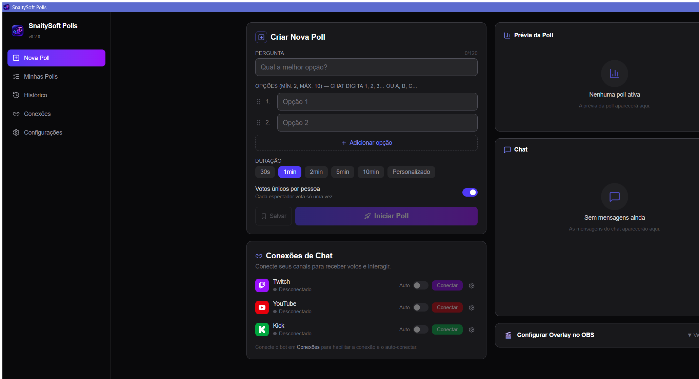
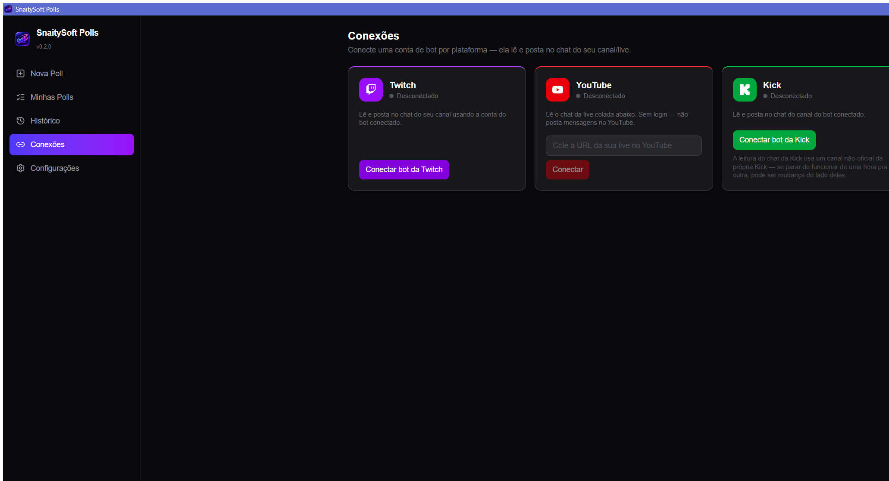
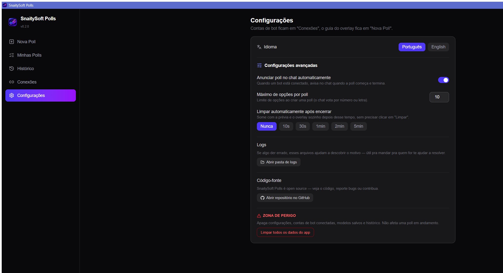

<a href="README.md">English</a> | <strong>Português (BR)</strong>

  

<h1 align="center">SnaitySoft Polls</h1>

App desktop (Windows/macOS/Linux) para rodar enquetes votadas pelo chat na Twitch, YouTube e
Kick simultaneamente — feito com <a href="https://tauri.app">Tauri v2</a> + <a href="https://nextjs.org">Next.js</a>.
Os espectadores votam digitando no chat, e o resultado aparece ao vivo num overlay de
browser-source do <a href="https://obsproject.com">OBS</a>.

  

## Instalação

Baixe o instalador mais recente pro seu sistema operacional na
**[página de Releases](https://github.com/SnaitySoft/SnaitySoft-Polls/releases)** — builds de
Windows, macOS e Linux são publicados automaticamente a cada versão.

## Capturas de tela

| Criar e gerenciar polls | Conexões de chat | Configurações |
|---|---|---|
|  |  |  |

## Como usar

1. **Conecte uma conta de chat** — abra **Conexões** e conecte uma conta de bot da Twitch e/ou
   da Kick (login via OAuth), ou cole a URL da sua live pro YouTube (sem precisar logar).
2. **Crie uma poll** — em **Nova Poll**, digite uma pergunta, adicione de 2 a 10 opções, escolha
   uma duração (ou uma personalizada) e, se quiser, ative votos únicos por espectador.
3. **Adicione o overlay no OBS** — copie a URL do overlay que aparece na barra lateral
   (`http://localhost:9898`) e adicione como um Browser Source no OBS; ele atualiza ao vivo via
   WebSocket, sem precisar dar refresh.
4. **Inicie a poll** — o espectador vota no chat pelo número, pela letra ou pelo próprio texto
   da opção; o placar ao vivo aparece tanto na prévia do app quanto no overlay do OBS.
5. **Deixe encerrar** — automaticamente quando o tempo acabar, ou encerre antes pelo app. Salve
   perguntas que você usa com frequência como modelos em **Minhas Polls**, e todo resultado
   passado fica guardado no **Histórico**.

## Funcionalidades

- **Votação multiplataforma pelo chat** — Twitch, YouTube e Kick ao mesmo tempo. O espectador
  vota pelo número (`1`, `2`, ...), pela letra (`a`, `b`, ...) ou pelo próprio texto da opção.
- **Overlay para OBS** — uma URL de browser-source (`http://localhost:9898`) que mostra a poll
  ao vivo e atualiza em tempo real via WebSocket, sem precisar dar refresh manualmente.
- **Votos únicos** — opção por poll pra contar no máximo um voto por espectador por plataforma.
- **Modelos e histórico** — salve uma poll pra relançar depois, e toda poll encerrada fica
  guardada com o resultado final.
- **Limpeza automática** — some com a prévia e o overlay sozinho um tempo configurável depois
  que a poll encerra.
- **Anúncios no chat** — opcionalmente avisa no chat quando uma poll começa e termina (Twitch e
  Kick; veja [Integrações por plataforma](#integrações-por-plataforma) pra entender por que o
  YouTube não posta).
- **Português e inglês** — detecta o idioma do sistema no primeiro uso, e dá pra trocar a
  qualquer momento em Configurações.

## Stack técnica

Rust + [Tauri v2](https://tauri.app) + [Axum](https://github.com/tokio-rs/axum) no backend,
Next.js (static export) + React + Zustand + Tailwind CSS no frontend. Detalhamento completo em
[docs/DEVELOPMENT.md](docs/DEVELOPMENT.md) (em inglês).

## Desenvolvimento

Quer rodar a partir do código-fonte ou contribuir com alguma mudança? Configuração, credenciais
OAuth, geração de build de release e o processo de CI estão todos em
**[docs/DEVELOPMENT.md](docs/DEVELOPMENT.md)**; o fluxo de contribuição e convenções de código
estão em **[docs/CONTRIBUTING.md](docs/CONTRIBUTING.md)** (ambos em inglês).

## Integrações por plataforma

Twitch e Kick se conectam via conta de bot e conseguem postar anúncios no chat. O YouTube é
**somente leitura** — sem login, só colando a URL da live — por isso não posta o anúncio de
início/fim que os outros dois conseguem. Cada plataforma exigiu uma abordagem diferente, às
vezes não-oficial, por baixo dos panos; a justificativa completa e os trade-offs estão em
[docs/DEVELOPMENT.md](docs/DEVELOPMENT.md#platform-integrations) (em inglês).

## Licença

MIT — veja [LICENSE](LICENSE).
